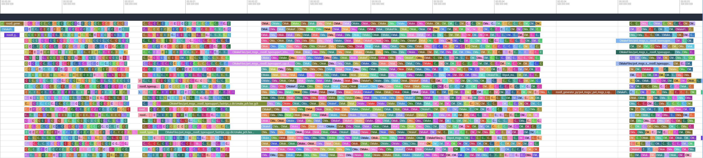

# rosidlcpp

## Known Limitations

- The IDL file parser cannot parse any IDL files. It was not built from the OMG IDL specification. It was built to parse the IDL files generated by `rosidl_adapter`. (I'm of course open to improving the parser to handle any IDL files.)
- It has not been tested with only one typesupport implementation. There are conditions that change the generated file significantly when only a single typesupport is used.
- Very few tests have been done with non-default configurations. For instance, the `--disable-description-codegen` option from `rosidl_generator_c` exists but has not been tested.
- Interfaces containing string defaults with unicode characters or '\' generate slightly difference files (might be a bug in the rosidl implementation so I'm leaving it as is for now). 
- **This is alpha quality software. Do not use in production.**

## Motivation

Building interfaces in ROS2 is slow. Interface packages with a lot of messages might even be the packages that take the most time to build in your workspace. If you work with `ublox_msgs` or `px4_msgs`, you know what I mean.

During the build, it doesn't look like the CPU is very busy. It might have one thread running a mysterious `rosidl_generator_` or `rosidl_typesupport_` script with shorter bursts where it's fully loaded in between.

Also, modifying a single interface file rebuilds the entire package. This, combined with the long build time, results in an unpleasant development process.

The idea behind `rosidlcpp` was to reimplement `rosidl` in C++ so that the scripts can be parallelized. The speedup of reimplementing in C++ was sufficient that multithreading still hasn't been started.

## Issues with rosidl

### Slow Python Generators


Most of the time spent building interface packages is spent on generating files. With the default install, 10 file generators need to run, each generating multiple files per interface:
1. `rosidl_generator_type_description` (1 file): Generates a JSON file with basic info on the interface and computes the hashes for each interface.
2. `rosidl_generator_c` (5 files including 2 `.c`): Generates the C API.
3. `rosidl_generator_cpp` (5 files): Generates the C++ API.
4. `rosidl_typesupport_c` (1 `.c` file).
5. `rosidl_typesupport_cpp` (1 `.cpp` file).
6. `rosidl_typesupport_fastrtps_c` (2 files including 1 `.cpp`).
7. `rosidl_typesupport_fastrtps_cpp` (2 files including 1 `.cpp`).
8. `rosidl_typesupport_introspection_c` (2 files including 1 `.c`).
9. `rosidl_typesupport_introspection_cpp` (2 files including 1 `.cpp`).
10. `rosidl_generator_py` (2 files including 1 `.c`): Generates the Python API.

I suspect there are two reasons for the generators to need this time:
- Parsing the IDL files (`rosidl_generator_type_description` generates a single file per message but still takes long).
- Complex file templates to generate (see the last generator `rosidl_generator_py`).

### Slow Compilation

Zooming in on the main compilation section (after the `rosidl_typesupport_`) reveals that some files take over 300ms to compile.


Adding [`-ftime-report`](https://gcc.gnu.org/onlinedocs/gcc/Developer-Options.html#index-ftime-report) to one of these build stages reveals that most of the time (around 90%) is spent parsing the file.

```
[3/5] Building CXX object CMakeFiles/px4_msgs__rosidl_typesupport_fastrtps_c.dir/rosidl_typesupport_fastrtps_c/px4_msgs/msg/detail/action_request__type_support_c.cpp.o

Time variable                                   usr           sys          wall           GGC
 phase setup                        :   0.00 (  0%)   0.00 (  0%)   0.00 (  0%)  1882k (  2%)
 phase parsing                      :   0.14 ( 88%)   0.11 (100%)   0.26 ( 93%)    68M ( 90%)
 phase lang. deferred               :   0.01 (  6%)   0.00 (  0%)   0.01 (  4%)  3741k (  5%)
 phase opt and generate             :   0.01 (  6%)   0.00 (  0%)   0.01 (  4%)  1746k (  2%)
 |name lookup                       :   0.04 ( 25%)   0.01 (  9%)   0.04 ( 14%)  2962k (  4%)
 |overload resolution               :   0.00 (  0%)   0.00 (  0%)   0.02 (  7%)  3727k (  5%)
 callgraph construction             :   0.01 (  6%)   0.00 (  0%)   0.00 (  0%)   272k (  0%)
 preprocessing                      :   0.01 (  6%)   0.04 ( 36%)   0.07 ( 25%)  2166k (  3%)
 parser (global)                    :   0.04 ( 25%)   0.02 ( 18%)   0.03 ( 11%)    25M ( 34%)
 parser struct body                 :   0.02 ( 13%)   0.00 (  0%)   0.02 (  7%)    17M ( 23%)
 parser function body               :   0.01 (  6%)   0.01 (  9%)   0.02 (  7%)  1857k (  2%)
 parser inl. func. body             :   0.02 ( 12%)   0.00 (  0%)   0.04 ( 14%)  2720k (  4%)
 parser inl. meth. body             :   0.00 (  0%)   0.02 ( 18%)   0.02 (  7%)  8009k ( 10%)
 template instantiation             :   0.05 ( 31%)   0.02 ( 18%)   0.06 ( 21%)    14M ( 19%)
 constant expression evaluation     :   0.00 (  0%)   0.00 (  0%)   0.01 (  4%)   118k (  0%)
 initialize rtl                     :   0.00 (  0%)   0.00 (  0%)   0.01 (  4%)    12k (  0%)
 TOTAL                              :   0.16          0.11          0.28           75M
```

The reason parsing the file takes so long is that its includes, once expanded, result in a file over 50,000 lines long and over 1MB. Each interface definition generator file includes the same headers that are parsed by the compiler for each file.

## What rosidlcpp Does Differently

1. Complete reimplementation in C++. The IDL files are parsed into JSON data structures and passed to the Inja template engine (Why Inja? It's the first result when searching "C++ template engine". I have no major complaints).
2. Precompiled headers. The headers shared by all interfaces are precompiled once, which significantly reduces the time it takes to compile each `.c/cpp` file.

The resulting build is almost entirely spent on actually compiling files:



### Replacing rosidl Generators (This is the Jankiest Part of rosidlcpp)

There is, to my knowledge, no clean way to replace existing generators with others.

To replace the `rosidl_` generators, the `rosidlcpp_` generators manually edit the CMake `AMENT_EXTENSIONS_rosidl_generate_idl_interfaces` variable (which is normally updated when calling `ament_register_extension`). Also, all `rosidlcpp_` generators only register as `rosidl_generator_packages`, even though typesupport would normally be expected to register `rosidl_typesupport_c[pp]`.

Apart from that, the build is the exact same as done by the `rosidl_` generators with `rosidl` substituted for `rosidlcpp` in some places.

## Benchmarks

Compilation time on AMD Ryzen 9 9900X 12-Core (24 threads) Processor, 32 GB of RAM. In a Docker container based on `osrf/ros:rolling-desktop-full`.

Time measured from the `.ninja_log` logs (there is about 1-2 seconds of additional overhead).

| Packages   | rosidl | rosidlcpp (not precompiled) | rosidlcpp | **rosidlcpp speedup** |
| ---------- | ------ | --------------------------- | --------- | --------------------- |
| test_msgs  | 7.680s | 2.435s                      | 2.090     | **3.7**               |
| px4_msgs   | 72s    | 14.450s                     | 5.685s    | **12.7**              |
| ublox_msgs | 42s    | 5.985s                      | 2.670s    | **15.7**              |

## How to Use

### Build from Source

```sh
# Clone into your workspace
git clone https://github.com/TonyWelte/rosidlcpp.git src/rosidlcpp
# Install dependencies
rosdep install --from-paths src/rosidlcpp --ignore-src
# Build
colcon build --base-paths src/rosidlcpp --cmake-args -DCMAKE_BUILD_TYPE=Release
# Source
source install/setup.bash
```

### Usage

1. Make sure to remove any previously built interface packages from your build/install directories.
2. Source the workspace where you built `rosidlcpp`.
3. Compile as you would normally. Several `--cmake-args` options can be added:
   - `-DCMAKE_DISABLE_PRECOMPILE_HEADERS=ON` Disable precompiled headers (requires CMake v3.16).
   - `-DUSE_ROSIDL_GENERATORS` Disable `rosidlcpp` generators and use the default `rosidl` generators instead.

## TODO

- Multithreading: Processing messages can be parallelized fairly easily and would probably gain an additional speedup.
- Branch for the last stable release: jazzy.
- Automated CI.
- Add tests (standard unit tests, also experiment with fuzz testing).
- Cleanup dependencies in CMakeLists.txt and package.xml